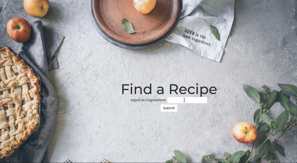
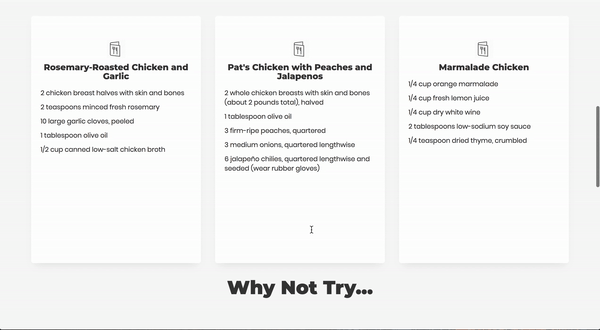

# Recipe Wizard
Winning Team: Recipe Wizards
- [Anna Ayzenshtat](https://github.com/annaayzenshtat)
- [Muriel Grobler](https://github.com/murielgrobler)
- [Sarah Colby](https://github.com/vernistage)

Women in Tech Machine Learning Product Hackathon

July 28-29, 2018

## Description

Are you done wondering what to cook for dinner every night? Recipe Wizard takes your cravings and returns to you two kinds of recipes: Ones that most closely match your desired ingredients and others that may not match your initial desires but the Wizard thinks you might like. The more Recipe Wizard learns about your tastes, the more accurate its recommended recipes.Gone is the frustation of wondering what to cook and purchasing expensive pre-planned meal kits.

## Local Installation

Clone this repository and *cd* into the project directory

Install a virtual environment for your dependencies. (You can also use [Anaconda](https://anaconda.org/).)

    python3 -m venv myvenv

Activate your local environment

    source myenv/bin/activate

Install the latest pip

    python3 -m pip install --upgrade pip

Install project requirements

    pip install -r requirements.txt

Boot-up app on your local server

    python manage.py runserver

## Web Application

Landing page, where users input ingredients.

Recipe Wizard sends the user a few recipes that most closely match the input ingredients.

Recipe Wizard sends the user recommended recipes that are similar to the user's tastes and input.
